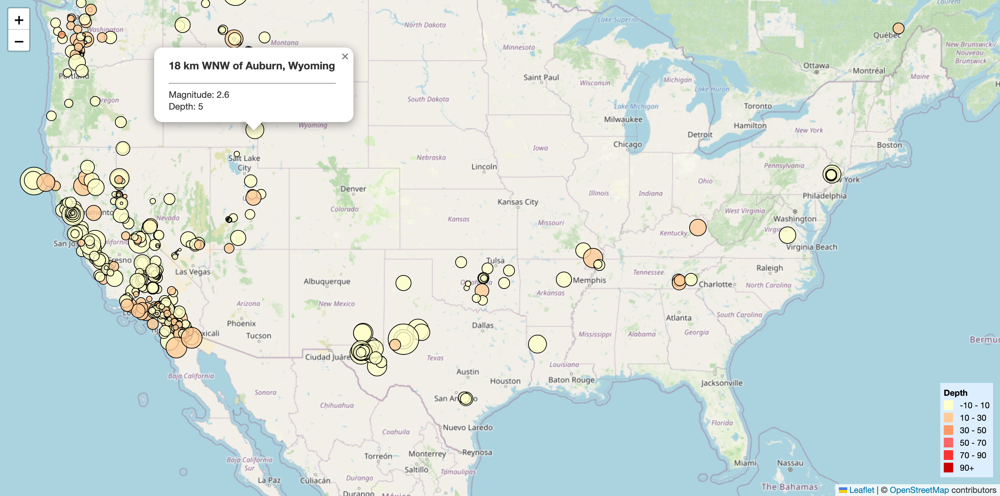
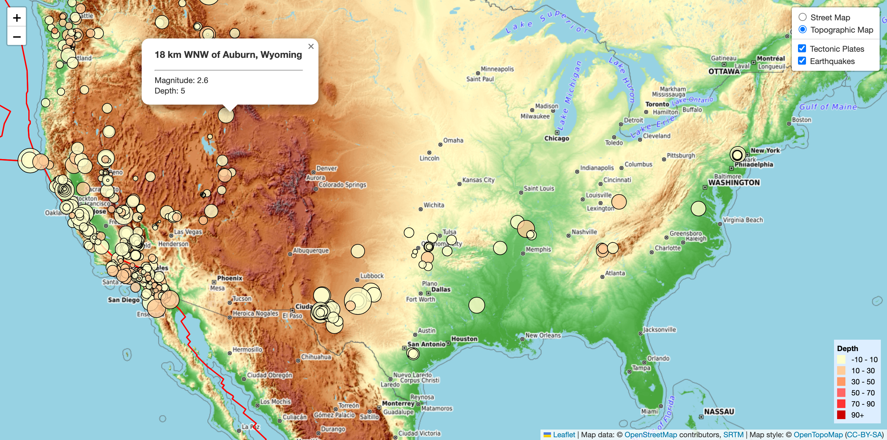

# leaflet-challenge

## Content:
1. [Overview](#1-overview)
2. [Repository](#2-repository)
3. [Deployment](#3-deployment)
4. [Screenshots](#4-screenshots)
5. [Data Source](#5-data-source)

## 1. Overview
The United States Geological Survey (USGS), is responsible for providing scientific data about natural hazards, the health of our ecosystems and environment, and the impacts of climate and land-use change.

This challenge aims to visualise USGS data that will allow them to better educate the public and other government organizations (and hopefully secure more funding) on issues facing our planet.

**Part 1**:
- All Earthquakes from the Past 7 Days was visualised. 
- Data markers reflect (A) the magnitude of the earthquake by their size, and (B) the depth of the earthquake by color.
- Earthquakes with higher magnitudes appeared larger, and earthquakes with greater depth appeared darker in color.
- Popups providing additional information about the earthquake would appear when its associated marker was clicked.
- A legend was created to provide context for the map data.

**Part 2**:
- This part was built on  Part 1.
- There were two base maps (Street Map & Topographic Map) to choose from.
- Tectonic plates dataset were plotted on the map in addition to the earthquakes.
- Each dataset was put into separate overlays that could be turned on and off independently.

## 2. Repository
- [`Leaflet-Part-1`](Leaflet-Part-1) contains all files required to run the visualisation of earthquake data. (`index.html`, `static/css/style.css`, `static/js/logic.js`)
- [`Leaflet-Part-2`](Leaflet-Part-2) contains all files required to run the visualisation of earthquake data and the data for tectonic plates. (`index.html`, `static/css/style.css`, `static/js/logic.js` `data/PB2002_plates.json`)
- [`images`](images) contains screenshots of the visualisations. 

## 3. Deployment
### Part 1
1. Clone the repository to your local computer. In your Terminal type `git clone https://github.com/bernardtse/leaflet-challenge.git`
2. Open `index.html` in your local web browser
- Alternatively, you can run the page directly on https://bernardtse.github.io/leaflet-challenge/Leaflet-Part-1

### Part 2
1. Make sure python is installed.
2. Navigate to the `Leaflet-Part-2` folder on the terminal: `cd Leaflet-Part-2`.
3. Type `python -m http.server`
4. Navigate to http://localhost:port in your local web browser. The port number (default: 8000) is displayed on the terminal. 
- Alternatively, you can run the page directly on https://bernardtse.github.io/leaflet-challenge/Leaflet-Part-2

## 4. Screenshots
### Part 1

### Part 2

## 5. Data Source
- Earthquake data: https://earthquake.usgs.gov/earthquakes/feed/v1.0/geojson.php
- Tectonic plates data: https://github.com/fraxen/tectonicplates/

